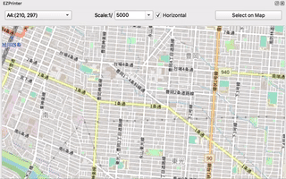

# EZPrinter
QGIS plugin to make pdf easily with Map area view.

# Sample

# Usage
- Choose a papersize and scale you want to make PDF map.
- Pushing "Select on map", you can select Print Area on MapCanvas.
- When you define Print Area, a dialog will pop-up.
- You can edit print settings - Title, Subtext and Scale bar.
- By "Export PDF", you can make PDF file where you want.

# Contact
kanahiro.iguchi@gmail.com